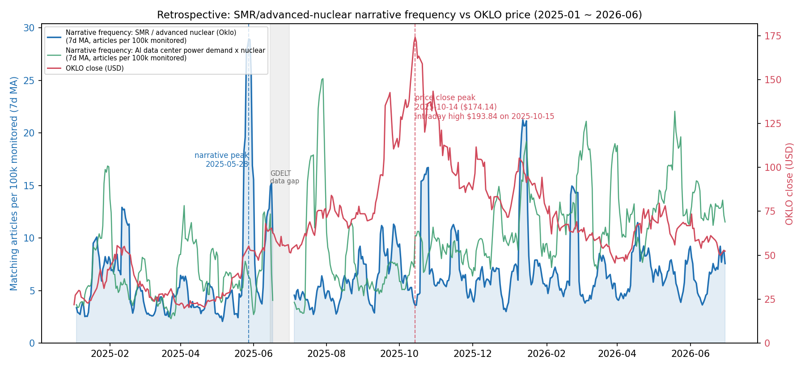

# news-narrative-tracker

[](https://github.com/jiwonsea/news-narrative-tracker/actions/workflows/ci.yml)

Quantify how loudly the market is talking about a theme — by counting news
articles, not by feel.

A minimal pipeline that collects financial news frequency data, matches it
against explicit theme dictionaries, and turns daily counts into a
**narrative momentum score** (rolling z-score + change rate). The MVP ships
with one retrospective demo: the "SMR / advanced nuclear" narrative
(2025-01 ~ 2026-06) overlaid on Oklo Inc. (NYSE: OKLO) share price.



## Why this exists

In a real trade of OKLO I failed to realize gains near the 2025-10 top.
Post-mortem: I had been tracking the market narrative — SMR, AI data-center
power demand — qualitatively, by impression. Impressions don't have units,
so they can't be compared across weeks or backtested. This project is the
corrective: turn narrative intensity into a number with a definition.

**This is a retrospective reconstruction, not a prediction engine.** The
demo queries were written in 2026 with full knowledge of the episode. No
"the tool would have called the top" claim is made anywhere, because that
claim cannot be supported by a backward-looking demo. What the demo *does*
show is that narrative frequency is measurable, that its peaks are datable,
and that their timing relative to price peaks can be studied.

## What the demo shows (verified numbers only)

All figures computed by `scripts/run_demo.py` from the snapshots in `data/`:

- SMR/advanced-nuclear narrative frequency (7-day MA of article share)
  peaked on **2025-05-28**; the 90-day rolling z-score peaked on **2025-05-24**.
- OKLO's closing-price peak was **2025-10-14 ($174.14)**; the all-time
  intraday high was **$193.84 on 2025-10-15** (Yahoo Finance chart API,
  retrieved 2026-07-02).
- Gap between narrative frequency peak and closing-price peak: **139 days**
  (narrative first). This is a description of one episode, not a
  generalizable lead-lag result.
- The companion theme "AI data center power demand x nuclear" peaked at a
  different time, illustrating that related narratives are separable.

## Method

```
collect (GDELT / RSS)  ->  match (theme dictionaries)  ->  score (momentum)
                                                        ->  report (HTML)
```

1. **Collect.** Primary source is the [GDELT DOC 2.0 API](https://blog.gdeltproject.org/gdelt-doc-2-0-api-debuts/):
   free, and supports historical range queries — the property that makes
   retrospective demos possible at all. Google News RSS and the Naver News
   API (v0.3, Korean market) are implemented for forward (daily)
   collection; neither can backfill history, so their stores are kept
   separate from GDELT series (not directly comparable).
2. **Match.** Themes are explicit keyword dictionaries
   (`config/themes.yaml`), not learned topics — every count is auditable.
   GDELT is queried with a theme's query string; RSS headlines are matched
   locally with substring rules.
3. **Normalize.** Daily count / total articles GDELT monitored that day
   (`norm`), so the metric is a share, robust to the news universe growing
   or shrinking. Days with collapsed totals are treated as missing.
4. **Score.** `momentum = 0.5 * z(share_ma7) + 0.5 * z(chg_28d)` where z is
   a trailing 90-day z-score. Level ("how unusual is today?") plus
   acceleration ("is it building or fading?"). Full definitions in
   `src/narrative_tracker/metrics.py`. If a hit-ratio-style metric is ever
   added, its exact definition must be printed next to the number.
5. **Report.** One self-contained HTML file (`reports/demo_report.html`)
   with a status badge, the chart, and explicit limitations.

Deliberately **out of scope for the MVP**: embeddings, sentiment analysis,
topic models. Frequency first; NLP only where a frequency baseline proves
insufficient (v2).

## Quick start

```bash
pip install -r requirements.txt
python scripts/run_demo.py         # offline, reproducible from data/ snapshots
python scripts/run_demo.py --fetch # refresh from the GDELT API (rate-limited)
python scripts/collect_forward.py  # live: append today's counts (run on a schedule)
python scripts/collect_forward.py --source naver  # needs Naver API credentials (see below)
python scripts/build_dashboard.py  # multi-theme signal-light dashboard (offline)
python scripts/fetch_gdelt_snapshot.py hbm_memory  # cache a theme's GDELT snapshot (needs network)
pytest                             # 36 tests: parsing, matching, metrics, forward store, naver, gdelt, dashboard
```

### Credentials (Naver, local)

The Naver collector needs `NAVER_CLIENT_ID` / `NAVER_CLIENT_SECRET`
(issue both at https://developers.naver.com/apps/, Search API). For local
runs, copy `.env.example` to `.env` and fill in the two values — the code
loads it automatically at import via python-dotenv. `.env` is gitignored;
never commit real keys. In CI the same variables come from GitHub Secrets,
so no `.env` is present and the loader is a harmless no-op.

## Theme selection (inclusion rule)

Which narratives get a dictionary is a stated policy, not an ad-hoc choice. A
theme is admitted only if it satisfies all three tests, applied the same way by
anyone (author-independent, the same auditability principle as using keyword
dictionaries over learned topics):

1. **Auditable** — expressible as an explicit keyword dictionary (EN + KR), so
   every match is explainable. Themes that need sentiment/embeddings to even be
   *defined* are out of scope at the frequency-first stage.
2. **Tradeable proxy** — maps to at least one liquid instrument or a small
   named basket, recorded in each theme's `proxy:` field, so timing can be
   overlaid on a price series.
3. **Active** — a currently-live market narrative (non-trivial trailing-90-day
   GDELT frequency), not a dormant or purely structural theme.

The rule governs **scope, not conviction**: inclusion says a theme is
measurable, overlayable, and live — not that it will work as a trade. The four
current themes and how each satisfies the rule (with proxies and one-line
rationales) are defined in `config/themes.yaml`.

## Repo layout

```
config/themes.yaml        theme dictionaries (edit here to track new narratives)
src/narrative_tracker/
  sources/gdelt.py        GDELT DOC API client (retrospective, primary)
  sources/google_news.py  Google News RSS (forward collection)
  sources/naver.py        Naver News API (v0.3, forward collection, Korean market)
  themes.py               dictionary loading + headline matching
  metrics.py              share, z-score, change rate, momentum
  pipeline.py             collect -> score
  forward.py              live collection store (dedupe + daily counts)
  report.py               HTML report + dashboard builder
scripts/run_demo.py       the Oklo/SMR retrospective demo
scripts/collect_forward.py  daily forward collector (--source google|naver)
scripts/build_dashboard.py  multi-theme signal-light dashboard
scripts/fetch_gdelt_snapshot.py  cache a theme's GDELT timeline into data/
data/                     cached snapshots (see data/README.md for provenance)
reports/                  generated chart + HTML report
tests/                    pytest suite
```

## Division of labor (human / AI)

- **Author (human):** problem definition, theme dictionary design, metric
  definitions (what to measure and why), interpretation of results, and the
  factual-accuracy rules below.
- **AI coding assistant (Claude):** code implementation, tests, and data
  retrieval plumbing, under the author's review.

This split is stated because it is true, and because the design decisions
— not the code volume — are where the author's judgment lives.

## Factual-accuracy rules (project policy)

- No "predicted / would have caught it" language. Retrospective demos are
  labeled as such, in the README and in every report.
- No accuracy-sounding numbers without a printed definition. A number like
  "87.5%" is meaningless (or misleading) unless the denominator, window,
  and success criterion are stated next to it.
- Data quirks are disclosed, not smoothed over: GDELT has a gap
  (2025-06-15 ~ 2025-07-01, shaded in the chart) and two collapsed-norm
  days; both are handled as missing data.

## Limitations

- One narrative, one stock, one episode: anecdotal by construction.
- GDELT counts English articles matching the query anywhere in the text;
  syndicated duplicates inflate counts.
- Keyword dictionaries drift: "SMR" collides with other meanings; queries
  written in 2026 benefit from hindsight vocabulary.
- Close-price series cannot show intraday extremes (the $193.84 high is
  annotated from a separate verified source).

## Roadmap

- **v0.2 (done):** forward daily collection via Google News RSS
  (`scripts/collect_forward.py`, deduped local store) + CI (pytest on
  Python 3.10/3.12, plus a full offline demo run).
- **v0.3 (done):** Naver News API collector (Korean market, env-var
  credentials, originallink dedupe, fixture-based tests), scheduled daily
  collection via GitHub Actions cron (auto-commits `data/forward/`), and a
  multi-theme signal-light dashboard (`reports/dashboard.html`, pattern
  shared with my macro-risk-monitor project). Two new themes added
  (HBM/AI memory, K-defense exports) — GDELT snapshots for them not yet
  cached, shown as NO DATA. Note: RSS/API stores cannot backfill and are
  not directly comparable to GDELT shares without normalization.
- **v0.4 (done):** hardening — headline matching moved to a left word
  boundary (fixes `(SMR)`/punctuation blind spots while preserving CJK
  adjacency and acronym-prefix intent); Naver collector gains retry/
  backoff, 429/5xx handling and optional pagination (up to 1000/query);
  local `.env` support (python-dotenv); `fetch_gdelt_snapshot.py` to
  cache GDELT snapshots for the HBM and K-defense themes.
- **Later:** sentiment/embedding enrichment, only if frequency alone proves
  insufficient.

---

## 한국어 요약 (Korean summary)

뉴스 기사 빈도로 시장 내러티브의 강도를 수치화하는 미니 파이프라인입니다.
OKLO 실거래에서 내러티브 전환을 정성적 감으로만 추적하다 2025-10 고점
구간에서 이익 실현에 실패한 경험이 출발점입니다. GDELT에서 일 단위 기사
수를 수집하고, 테마 사전(키워드 딕셔너리) 매칭과 정규화(일일 전체 기사
수 대비 비중)를 거쳐, 90일 롤링 z-score + 28일 변화율 기반의 내러티브
모멘텀 스코어를 산출합니다.

데모는 "SMR/선진원전" 내러티브(2025-01~2026-06)를 OKLO 주가와 겹쳐 그린
**사후 재구성(retrospective)** 차트 1장입니다. 검증된 수치만 기재:
내러티브 빈도(7일 이동평균) 피크 2025-05-28, OKLO 종가 피크 2025-10-14
($174.14), 장중 최고가 $193.84는 2025-10-15 (Yahoo Finance 기준,
2026-07-02 조회). 두 피크 간 간격 139일. 이는 단일 사례의 기술적
서술이며, "예측했다"는 주장이 아닙니다.

v0.3에서는 네이버 뉴스 API 정방향 수집기(환경변수 키, originallink
우선 중복 제거, fixture 기반 테스트), GitHub Actions cron 일일 자동
수집(data/forward/ 자동 커밋), 테마별 신호등 대시보드
(reports/dashboard.html — ELEVATED/NEUTRAL/FADING은 표현 버킷이지 매매
신호가 아님)를 추가했습니다. RSS/네이버 정방향 저장소는 과거 백필이
불가능해 GDELT 비중 시계열과 직접 비교하지 않습니다.

역할 분담: 문제 정의·테마 사전 설계·지표 정의·결과 해석은 본인,
코드 구현·테스트는 AI 코딩 어시스턴트(Claude)와의 협업입니다.
